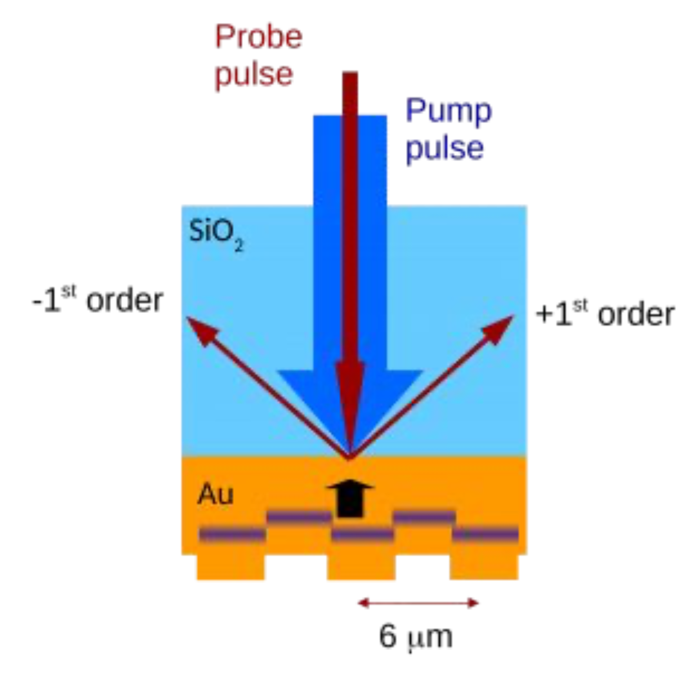
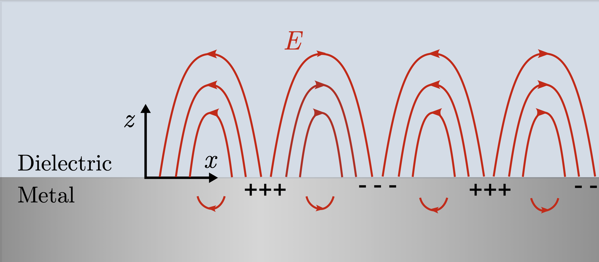
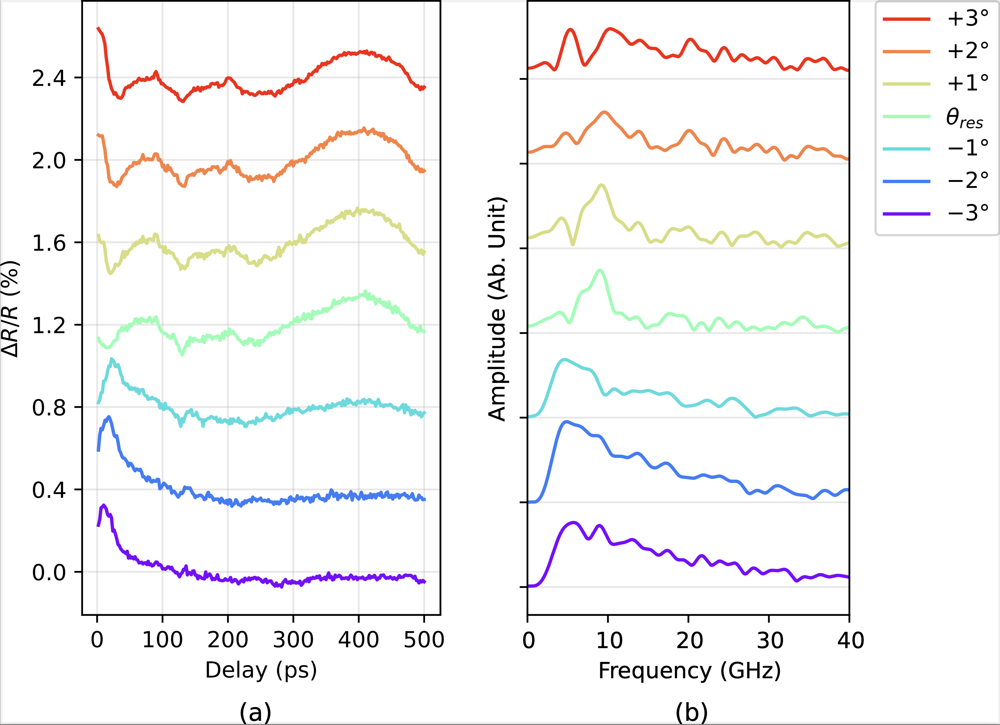
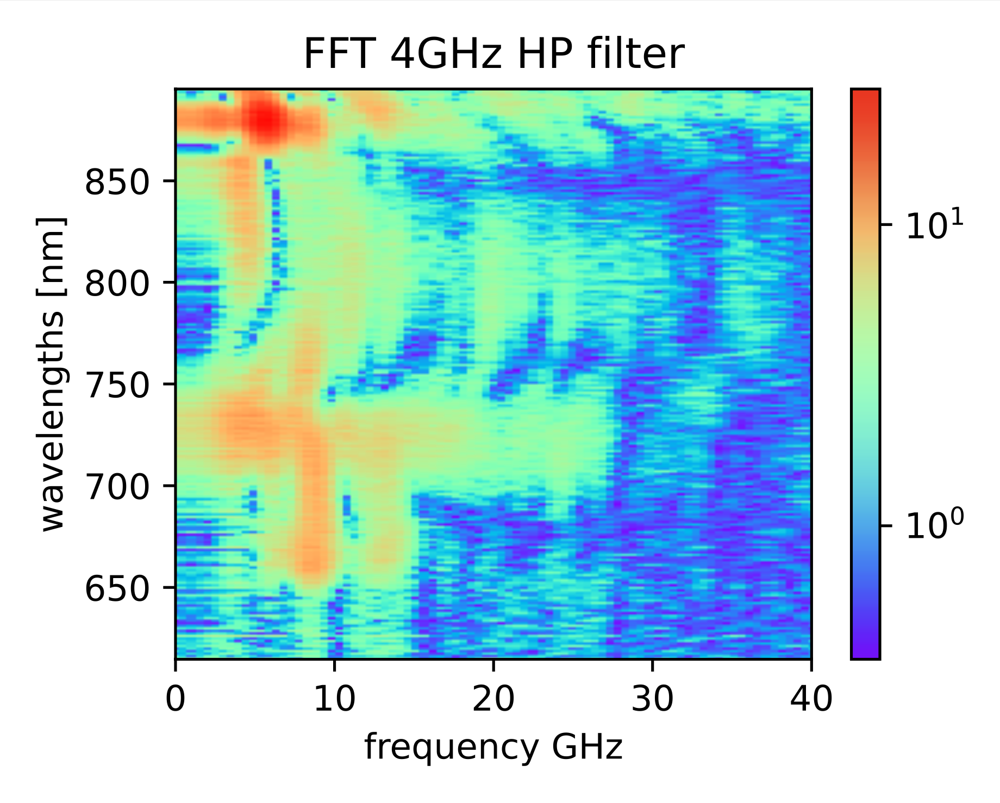

# ARCNL Photoacoustics Research Data Analysis



## Overview

This is the data analysis part of a research internship project at ARCNL - Advanced Research Center for Nanolithography. This project investigates laser-induced photoacoustics in a 130 nm aluminium grating, with a focus on how surface plasmon polaritons (SPPs) influence the detection of acoustic waves. By combining laser experiments with computational analysis and visualization, the study aims to better understand the propagation of laser-induced strain waves in thin metal gratings. This research has potential interest in nanolithography used in cutting-edge semiconductor manufacturing technology.

The repository includes Python scripts for processing and analyzing data. These scripts cover tasks such as data manipulation and cleaning, spectral calibration, time-frequency domain analysis using the Fast Fourier Transform (FFT), data point interpolation, and frequency filtering. Visualizations generated with Matplotlib yield a range of figures that support scientific communication in contexts like the corresponding master’s thesis and presentations.

## Directory Structure

- **Data/**  
  Contains experimental data files, processing scripts, and analysis routines.  
  - **AFM/**: 
    - *`crosssection_plot.py`* plots AFM measurements of the grating surface (height and phase data).  
  - **Resonance angle calculation data/**:  
    - *`Al resonance angle calculation.py`*: Calculates the resonance angle for aluminium.  
    - *`plot Al res wl vs angle.py`*: Plots the resonance wavelength versus incidence angle.  
  - **grating 750nm measurement/**:  
    Raw measurement data organized by date (e.g., 20240212, 20240213, etc.). Each date folder contains:  
    - Raw data files (.obt, .dat, .txt)  
    - *`data_processing_script.py`*: Processes the raw data (averaging, delta calculations, etc.) and generates outputs.  
    - *`grating 750nm probe measurement plots.py`*: Visualizes probe measurement data.  
  - **grating spectrum/**:  
    Contains spectroscopic data and scripts such as *`spectrometer plot.py`* and *`spectrum_plot_script.py`* for plotting reflection spectra.  
  - **grating whitelight measurement/**:  
    - *`data_processing_wlreflection.py`*: Processes whitelight raw measurement data.  
    - *`whitelight pumpprobe 2dplot.py`*: Generates 2D pump–probe plots from the data.  
  - **Additional scripts**:  
    - *`peak fluence.py`*: Calculates or processes the laser peak fluence.  
    - *`data into npzfile.py`*: Converts raw data into NPZ format.  
    
  - **750nm -1 to +1 data** and **750nm -3 to +3 data**:  
    Include scripts (*`plot_script.py`*, *`data_processing_script.py`*) for analyzing data taken at different angular configurations.

- **Figures/**  
  Contains generated figures and plots that visualize experimental results, such as AFM cross-sectional images, transient grating measurements, and spectroscopic data.

- **Thesis/**  
  Contains the final thesis document and presentation that detail the experimental work and analysis.


## Requirements

- **Python 3.x**  
- Python packages:  
  - NumPy  
  - SciPy  
  - Matplotlib  
> [!NOTE]  
Data processing scripts (Python files with `data_processing` in their name) are designed to parse raw data files from laboratory equipment using the proprietary `oberon_package`—which is required to read `result.dat` files. Consequently, these scripts cannot be executed outside the ARCNL environment. However, once the raw data is parsed, it is mostly rewritten into `.txt` files for subsequent processing with the other scripts included.
  

## Usage

1. **Clone the repository**:
    ```sh
    git clone https://github.com/jeffrunningit/photoacoustics-research.git
    cd photoacoustics-research
    ```
2. **Run the processing scripts**:  
  The `run_scripts.py` file is a convenient launcher that presents a menu of selected Python modules from the project. It allows you to easily run these scripts from the root directory.
    ```bash
    python run_scripts.py
  - Or running the scripts directly:
     - Navigate to the specific data subdirectory (e.g., `Data/grating 750nm measurement/750nm -1 to +1 data`).  
     - Run the corresponding processing script:  
     ```bash
     python plot_script.py
     ```


- Since the specific processing and parameters required, such as FFT and frequency filtering threshold, changes depending on the experiment, scripts were added throughout the duration of this research project and the experimental data are organized by date and measurement type. Verify that you are working in the correct directory for the data set of interest.
- Some scripts are optimized for specific datasets and may require minor modifications for use with other data.
### Relative reflection change at angles around resonance in time and frequency domain (FFT)



### Spectrogram of reflection changes in frequency domain (FFT)



## Acknowledgements

This project is part of an in-depth study on laser-induced photoacoustics and plasmonic effects in aluminium gratings. The detailed experimental work and analysis are documented in the Thesis folder.